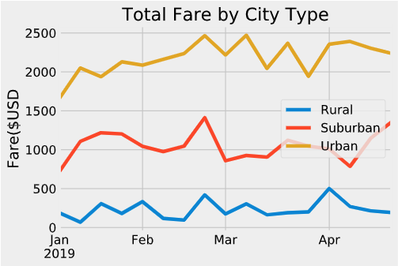

# PyBer Analysis

## Summary
Exploratory analysis of PyBer rideshare services based on city, city type, number of drivers, and fare financials.  As a new PyBer data analyst, manager Omar assisted with the analysis, reading raw data from csv files provided and translating them for use through Python 3.7, Jupyter Notebook, and pandas/matplotlib libraries.
### Data by City Type

Urban and Suburban cities drew the highest volume and total fares, but Rural cities impacted revenue with higher fares per ride.  Drivers averaged significantly higher fares, while less quantity, due to their more remote nature.
#

Total fares remained relatively flat throughout the months analyzed and showed no direct correlation to each other.  The time of year did not point to any notable relations between the city types and the total fares.

## Challenges
The raw csv data provided was complete with no missing entries.  This assisted analysis by not having to modify results or explain missing information.  The data was also consistant throughout, so minimal formatting was required.  Moving forward this is a huge benefit for analyzing the data quickly and accurately.  The raw data was limited to provide further analysis.

## Recommendations
The analysis results confirmed the assumption that more rural rides would provide less quantity, but higher quality, or fare amount.  Urban areas provided most of the rides, but at lower total fares.  Suburban cities proved relatively flat between the two as expected.
### Further Analysis 1
Future insight and analysis could be gained from capturing the distance traveled for each fare according to the city and type.  Knowing the distance traveled, we could determine the profitability from each fare based on fuel and time spend driving for each.
### Further Analysis 2
Knowing the profitability of fares based on specific city types, we could implement more drivers to specific areas, or reduce in others, to find where the highest margins can be gained.  It should be conisdered that flooding the supply of drivers to a certain area might reduce the total fares of each driver, and reduce their overall profitability, which could in turn result in losing drivers.  Conversely, reducing drivers could result in lost fares due to unavailabiity, and business would be lost.
